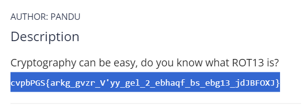
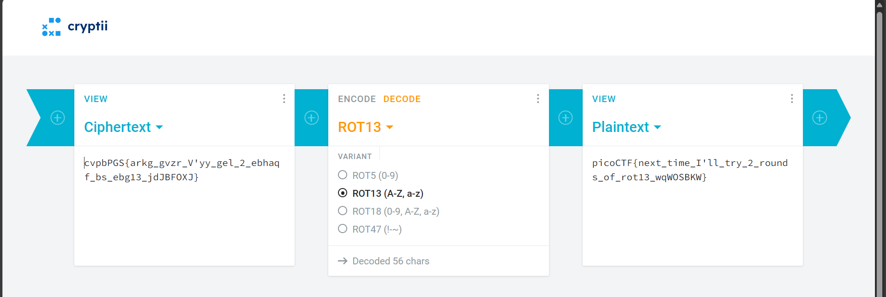
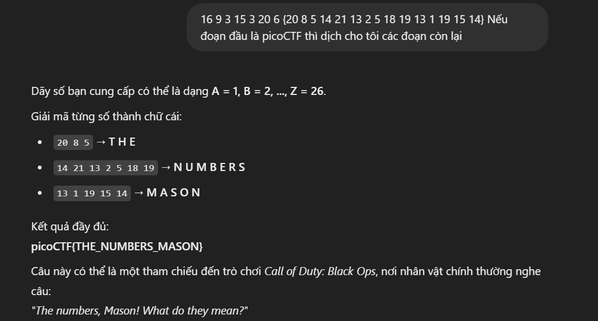
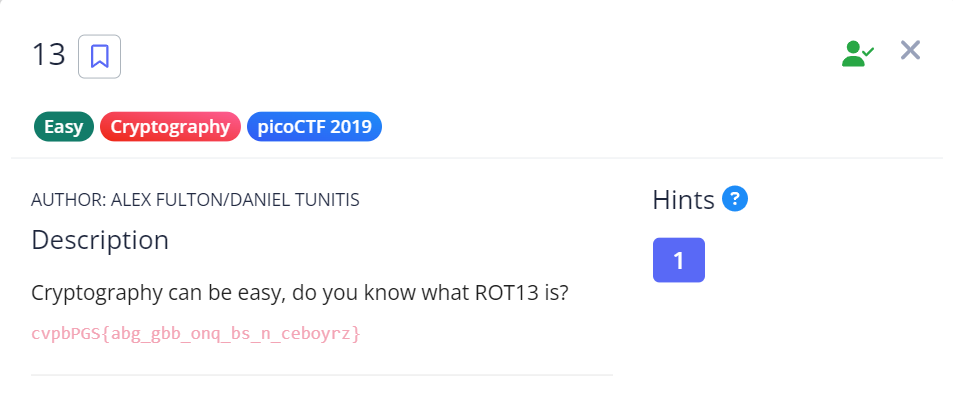
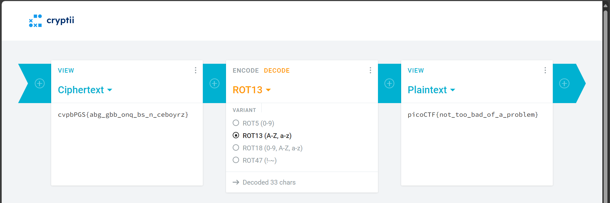
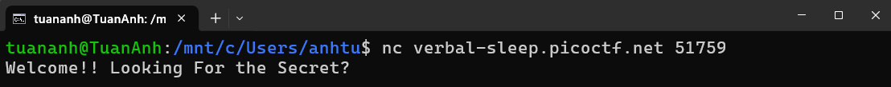
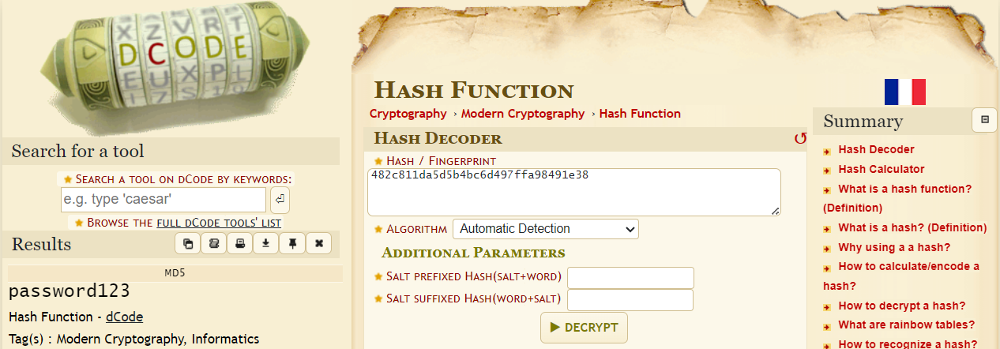
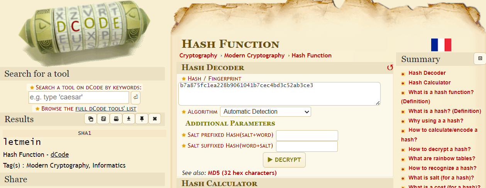
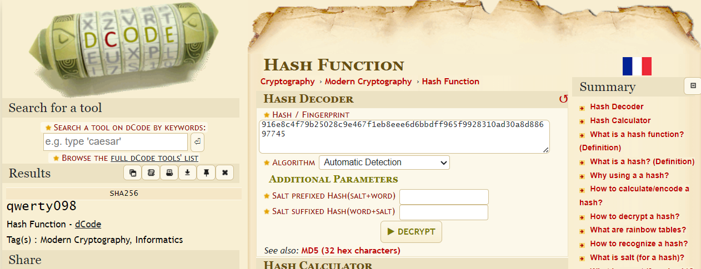
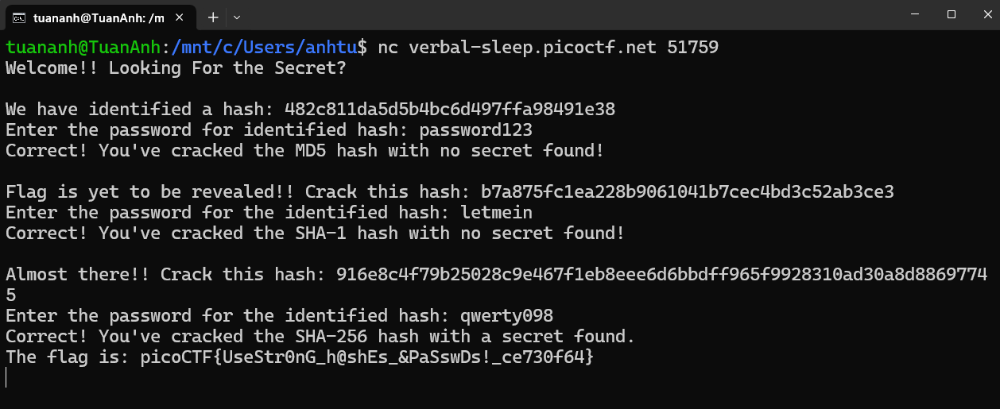

# CTF - CRYPTOGRAPHY

> _"Trang này chủ yếu lấy những chủ đề CTF về Cryptography đến từ Pico CTF. Từ easy -> medium -> hard."_

[CTF from picoCTF](https://play.picoctf.org/)

## ⚙️ Các công cụ được sử dụng để làm bài

- WSL

## 1️⃣ Các bài mức dễ

### Mod 26

Bài làm: [Tại đây](https://play.picoctf.org/practice/challenge/144?page=5)

Tool bài này là ROT13 Decoder, [links tại đây](https://cryptii.com/pipes/rot13-decoder)

**Bước 1:** Đề cho tôi đoạn code sau *"cvpbPGS{arkg_gvzr_V'yy_gel_2_ebhaqf_bs_ebg13_jdJBFOXJ}"* và yêu cầu tôi giải ra.

**Bước 2:** Với việc đoạn đầu luôn là picoCTF, ta có thể biết được đoạn chương trình bị mã hóa theo kiểu mod26, mà nó lại trùng với ROT13 nên dùng ROT13 decoder cho dễ.

Đoạn mã: **picoCTF\{next_time_I'll_try_2_rounds_of_rot13_wqWOSBKW\}**

***Kết thúc!***

### The Numbers

Bài làm: [Tại đây](https://play.picoctf.org/practice/challenge/68?page=6)

**Bước 1:** Xem đoạn mã sau, ta thấy nội dung là một dãy số.

**Bước 2:** Cứ tưởng là đoạn số vô nghĩa, nhưng xét theo nội dung **picoCTF** ở đầu, tôi nghĩ dãy số này tượng trưng cho vị trí của từng ký tự, vì vậy tôi thử thay thế và tìm được đoạn mã như này.

Đoạn mã: **picoCTF{THE_NUMBERS_MASON}**

***Kết thúc!***

### 13

Bài làm: [Tại đây](https://play.picoctf.org/practice/challenge/62?page=6)

Tool bài này là ROT13 Decoder, [links tại đây](https://cryptii.com/pipes/rot13-decoder)

**Bước 1:** Đề cho tôi đoạn code sau *"cvpbPGS{abg_gbb_onq_bs_n_ceboyrz}"* và yêu cầu tôi giải ra.

**Bước 2:** Với việc đoạn đầu luôn là picoCTF, ta có thể biết được đoạn chương trình bị mã hóa theo ROT13.

Đoạn mã: **picoCTF\{not_too_bad_of_a_problem\}**

***Kết thúc!***

### hashcrack

Bài làm: [Tại đây](https://play.picoctf.org/practice/challenge/475?page=1)

**Bước 1:** Theo yêu cầu đề bài cần chạy lệnh *"nc verbal-sleep.picoctf.net 51759"*, mà lệnh này thì chạy bằng *Ubuntu* nên tôi sẽ dùng *WSL* để chạy.

**Bước 2:** Sau khi kết nối thành công, bài sẽ gửi về đoạn mã **482c811da5d5b4bc6d497ffa98491e38**, tiến hành giải băm vì nó khá đơn giản.

**Bước 3:** Sau khi giải băm đoạn này, tiếp tục có đoạn băm **b7a875fc1ea228b9061041b7cec4bd3c52ab3ce3**, tiến hành giải băm (trang web gợi ý đoạn mã được băm theo dạng MD5).

**Bước 4:** Bài làm lại yêu cầu giải băm theo định dạng SHA-1 có mã là **916e8c4f79b25028c9e467f1eb8eee6d6bbdff965f9928310ad30a8d88697745**, tiến hành giải băm.

**Bước 5:** Sau khi làm hết các nội dung băm trên, ta có mã CTF Flag cần tìm

Đoạn Flag: **picoCTF\{UseStr0nG_h@shEs_&PaSswDs!_ce730f64\}**

***Kết thúc!***

## 2️⃣ Các bài mức trung bình

## 3️⃣ Các bài mức khó

