# CTF - GENERAL SKILLS  

> _"Trang này chủ yếu lấy những chủ đề CTF về General Skill đến từ Pico CTF. Từ easy -> medium -> hard."_

## 📌 Mục lục

[CTF from picoCTF](https://play.picoctf.org/)

## ⚙️ Các công cụ được sử dụng để làm bài

- Git (tôi đã có 1 phần nói về cái này). [Xem tại đây](../Tutorial/Git.md)

- Python (Ai học chắc cũng biết đây là 1 nnlt nhỉ). [Tải ứng dụng tại đây](https://www.python.org/downloads/)

## 1️⃣ Các bài mức dễ 

### Time Machine

Bài làm: [Tại đây](https://play.picoctf.org/practice/challenge/425?page=2)

**Bước 1:** Sau khi tải và giải nén file, tôi thấy folder chỉ có *1 file .txt* và *1 folder .git*.

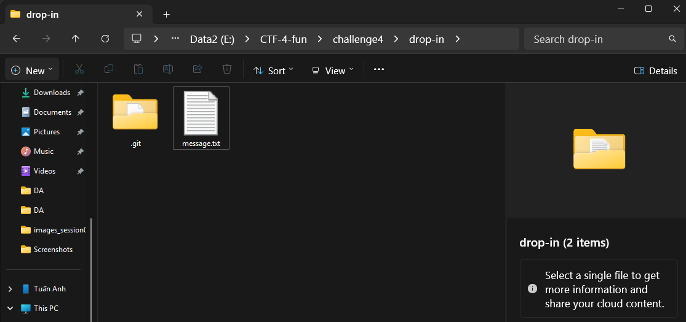

**Bước 2:** Kiểm tra thì tôi thấy được *file message.txt* chỉ có nội dung sau

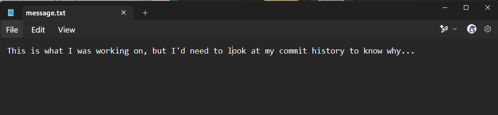

**Bước 3:** Theo nội dung trong *file message.txt* thì tôi có thể thấy được nội dung gì đã khi kiểm tra lịch sử commit. Trong bài này, tôi sẽ sử dụng lệnh sau:

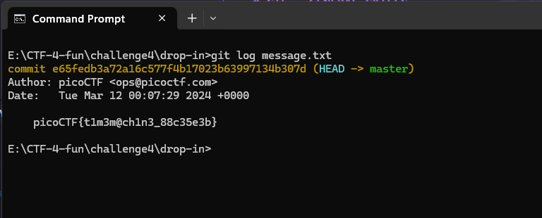


***Kết thúc!***

### Commitment Issues

Bài làm: [Tại đây](https://play.picoctf.org/practice/challenge/411?page=3)

**Bước 1:** Tất nhiên là tải file tài nguyên và giải nén trước. Sau đó tôi thấy file sau khi nén chỉ có *1 file .txt* và *folder .git*

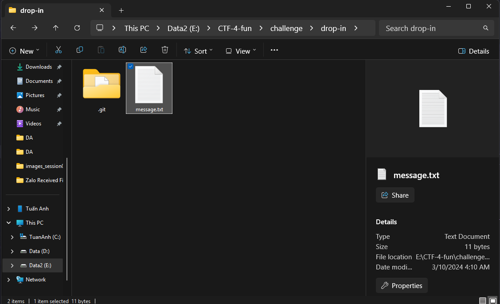

**Bước 2:** Kiểm tra *file .txt*, tôi sẽ thấy không có kết quả gì cả.

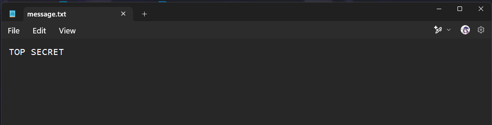

**Bước 3:** Nhìn lại các folder có, có *folder .git*, vì vậy tôi sẽ nghĩ ngay tới kiểm tra các sự kiện đã xảy ra với *git.* Lệnh sử dụng trong bài này sẽ là:

```
git log
```

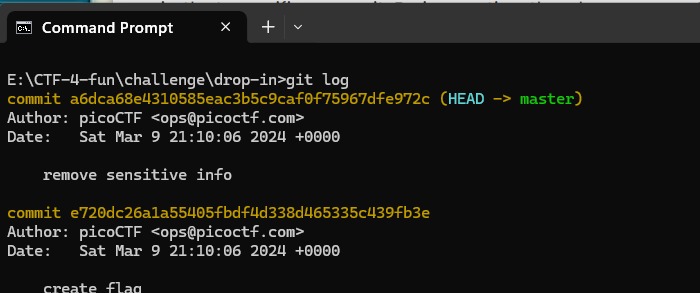

**Bước 4:** tôi thấy đoạn *commit a6dca68e4310585eac3b5c9caf0f75967dfe972c* đã bị xóa, thử show ra bằng lệnh:

```
git show a6dca68e4310585eac3b5c9caf0f75967dfe972c
```


***Kết thúc!***

### Collaborative Development

Bài làm: [Tại đây](https://play.picoctf.org/practice/challenge/410?page=3)

**Bước 1:** Vẫn là tải file về và giải nén tài nguyên. Quan sát thấy chỉ có *1 file flag.py* và *folder .git*

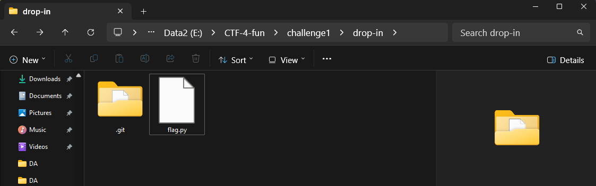

**Bước 2:** Thử kiểm tra và chạy *file flag.py* bằng lệnh:

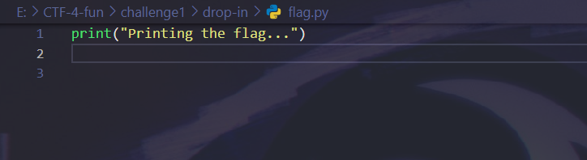

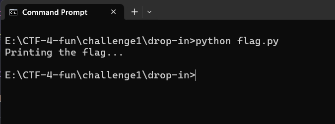

**Bước 3:** Chứng tỏ đoạn chương trình này không có flag cần tìm. Vậy nếu sử dụng lệnh log như nãy thì sao?

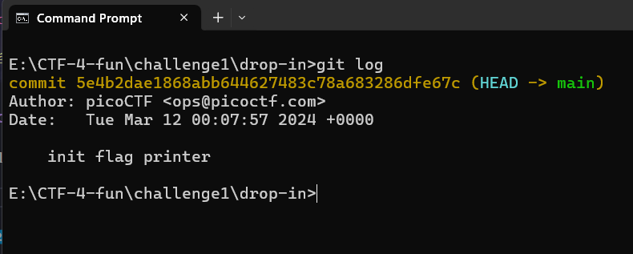

*Hoàn toàn không có gì!*

**Bước 4:** Lúc này, tôi sẽ thử kiểm tra các yếu tố khác, ví dụ như mình đã kiểm tra các nhánh (branch) bằng lệnh:

```
git branch -a
```

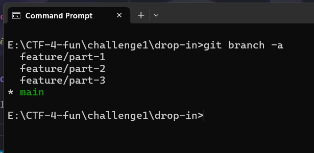

*Khá may mắn vì thấy có nhiều nhánh phụ trừ nhánh chính (main)!*

**Bước 5:** Thử chuyển qua nhánh phụ và chạy lại *file flag.py* và xem kết quả. Lệnh chạy:

```
git checkout feature/part-1
python flag.py
git checkout feature/part-2
python flag.py
git checkout feature/part-3
python flag.py
```

Hoặc nhanh hơn:

```
git checkout feature/part-1 && python flag.py && git checkout feature/part-2 && python flag.py && git checkout feature/part-3 && python flag.py
```

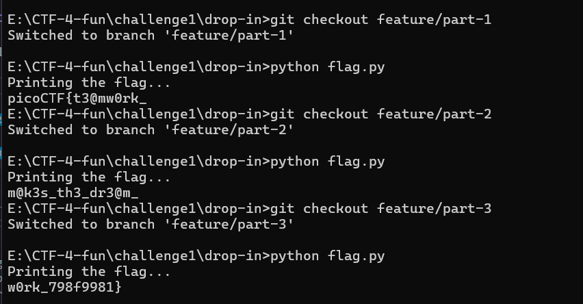

*Vì có 3 nhánh nên đoạn Flag đã bị chia thành 3, tôi chỉ việc ghép lại là hoàn thành!*

**Lưu ý: có một số thiết bị phải chạy python3 thay vì python như máy tôi!**

***Kết thúc!***

### Blame Game

Bài làm: [Tại đây](https://play.picoctf.org/practice/challenge/405?page=3)

**Bước 1:** Vẫn là tải file về và giải nén tài nguyên. Quan sát thấy chỉ có *1 file message.py* và *folder .git*

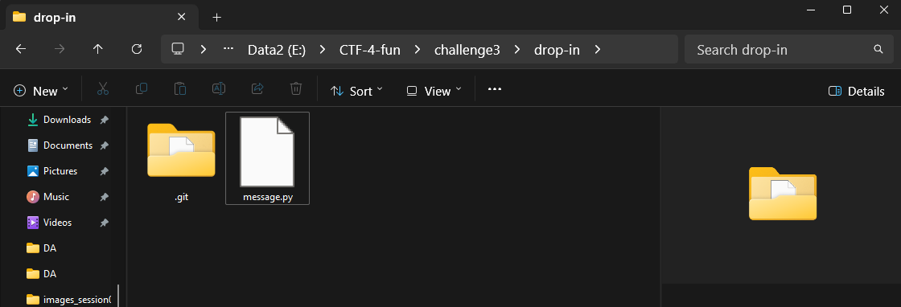

**Bước 2:** Thử kiểm tra và chạy *file message.py* bằng lệnh:

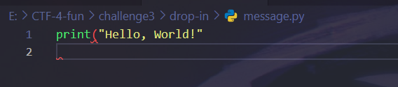

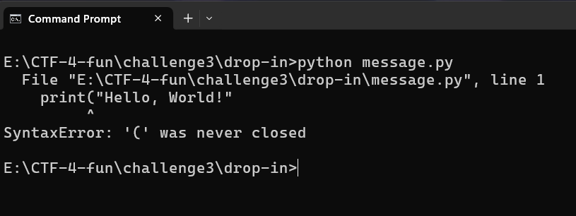

**Bước 3:** Chứng tỏ đoạn chương trình này không có flag cần tìm. Vậy nếu sử dụng lệnh log và branch như nãy thì sao?

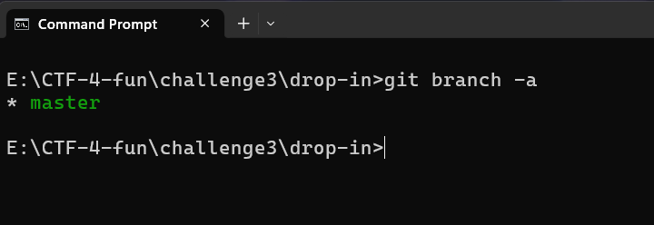

*Hoàn toàn không có gì!*

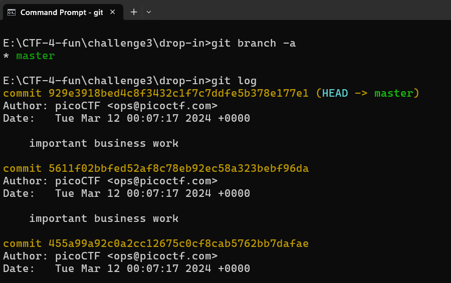

*Lệnh log thì chạy liên tục, khiến tôi khó quan sát.*

**Bước 4:** Lúc này, tôi thử chỉ kiểm tra log của *file message.py*.

```
git log message.py
```

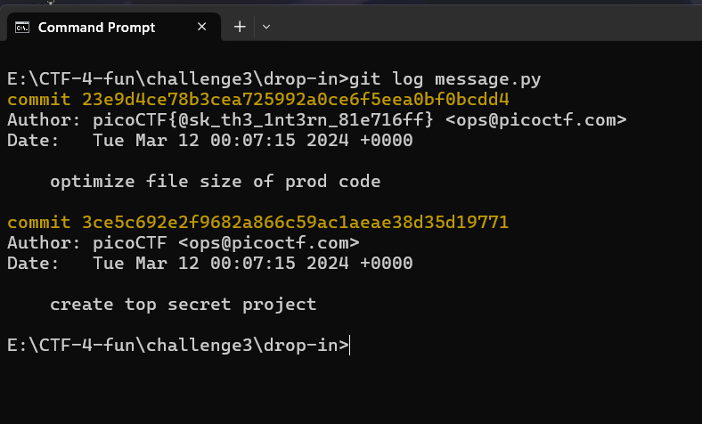

***Kết thúc!***

### Big Zip

Bài làm: [Tại đây](https://play.picoctf.org/practice/challenge/322?page=3)

**Bước 1:** Đây là 1 file zip khá lớn, khi tải về và giải nén, tôi sẽ thấy có rất nhiều file trong đây.

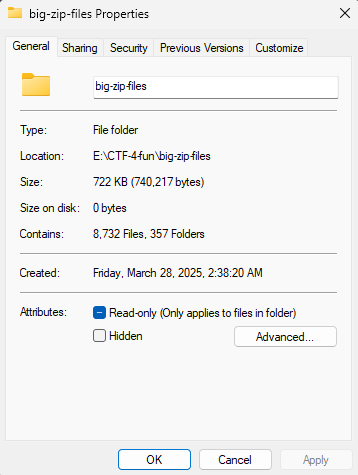

**Bước 2:** Kiểm tra vài định dạng file, tôi thấy các file là *file .txt* và các *folder chứa file .txt*

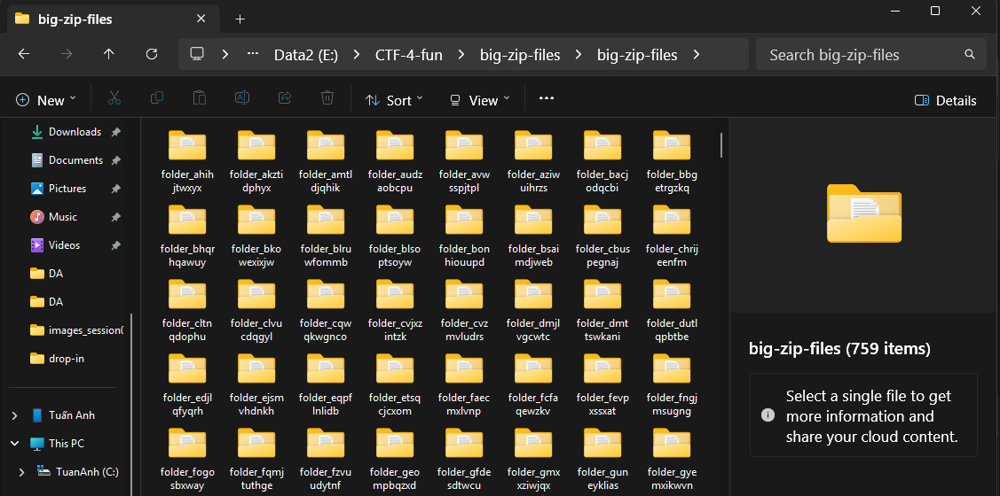

**Bước 3:** Lúc này, kiểm tra thủ công là 1 quyết định không hay! Vì vậy, tôi sẽ sử dụng 1 lệnh có sẵn của Terminal (có sẵn trong Windows và cả Linux).

```
findstr /s /i "CTF" *.txt
```

**Trong đó:**

- Lệnh findstr: là lệnh dùng để tìm ký tự.

- /s: tìm trong tất cả folder.

- /i: không phân biệt hoa thường.

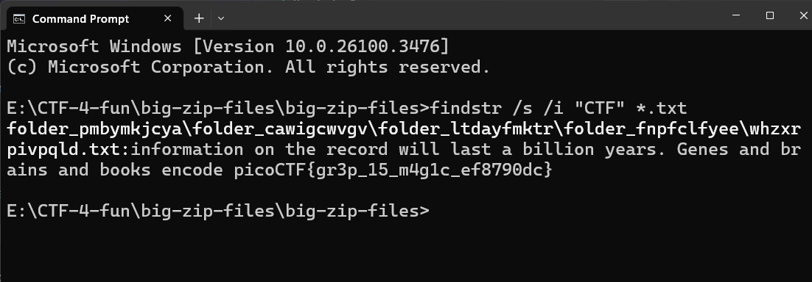

***Kết thúc!***

### First Find

Bài làm: [Tại đây](https://play.picoctf.org/practice/challenge/320?page=3)

**Bước 1:** Đây là 1 file zip khá lớn, khi tải về và giải nén, tôi sẽ thấy có rất nhiều file trong đây.

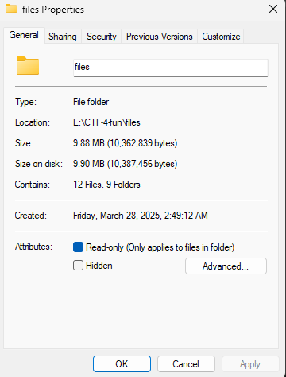

**Bước 2:** Kiểm tra vài định dạng file, tôi thấy các file là *file .txt* và các *folder chứa file .txt*

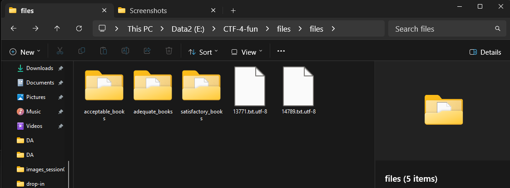

**Bước 3:** Lúc này, đề yêu cầu tôi phải tìm được file *uber-secret.txt*. Tất nhiên với bài này, việc tìm kiếm không hề khó. Nhưng nếu lượng file và folder nhiều hơn, tôi phải làm sao? 

Lúc này đã có 1 lệnh có sẵn trong terminal, đó là:

```
dir /s /b "uber-secret.txt"
```

**Trong đó:**

- Lệnh dir: Hiển thị danh sách file và thư mục.

- /s: Tìm trong tất cả folder.

- /b:  Chế độ "bare" (không hiển thị thông tin bổ sung, chỉ in ra đường dẫn file).

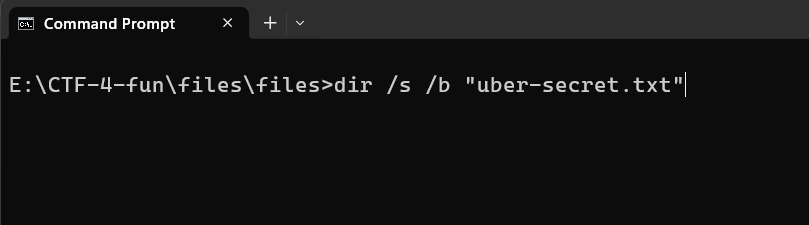

**Bước 4:** Dù sao đề vẫn yêu cầu là mã CTF, nên tôi chỉ cần copy đường dẫn và dán lại vào terminal là được.

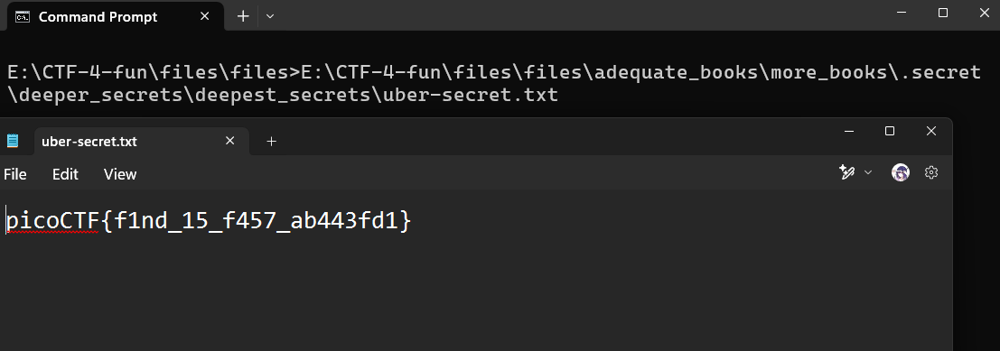

***Kết thúc!***

### Codebook

Bài làm: [Tại đây](https://play.picoctf.org/practice/challenge/238?page=4)

**Bước 1:** Tải về và kiểm tra file *code.py* và file *code.txt*.

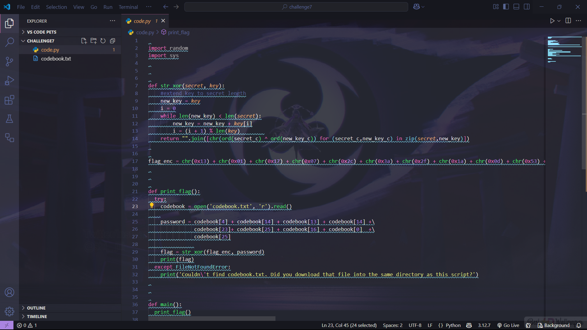

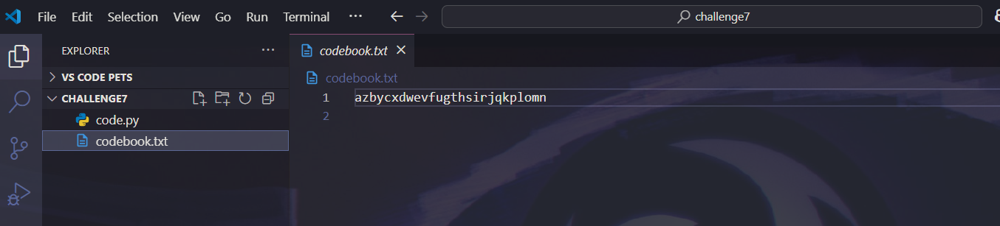

**Bước 2:** Việc đoạn mã trong *code.txt* giống 1 chuỗi ngẫu nhiên, nhưng thực ra là 1 chuỗi sau khi bị encrypt, vì vậy lần này tôi chỉ việc chạy file *code.py* để decrypt ra.

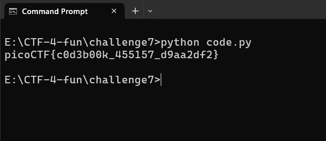

***Kết thúc!***

### PW Crack 1

Bài làm: [Tại đây](https://play.picoctf.org/practice/challenge/245?page=4)

**Bước 1:** Sau khi tải file tài nguyên và file checker thì tôi sẽ có 2 file sau:

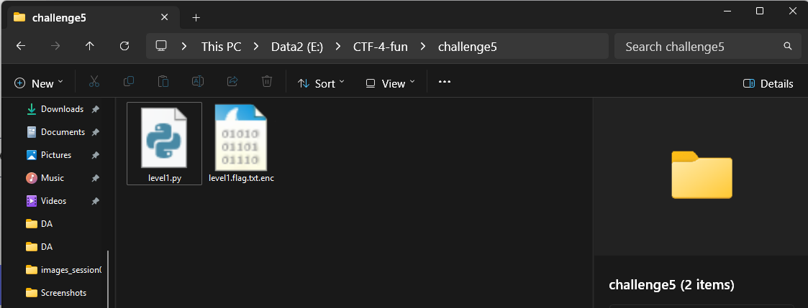

**Bước 2:** Thử kiểm tra file *level1.py*, sẽ thấy file này mục đích tìm Flag, và việc của tôi là gõ đúng mật khẩu để chạy.

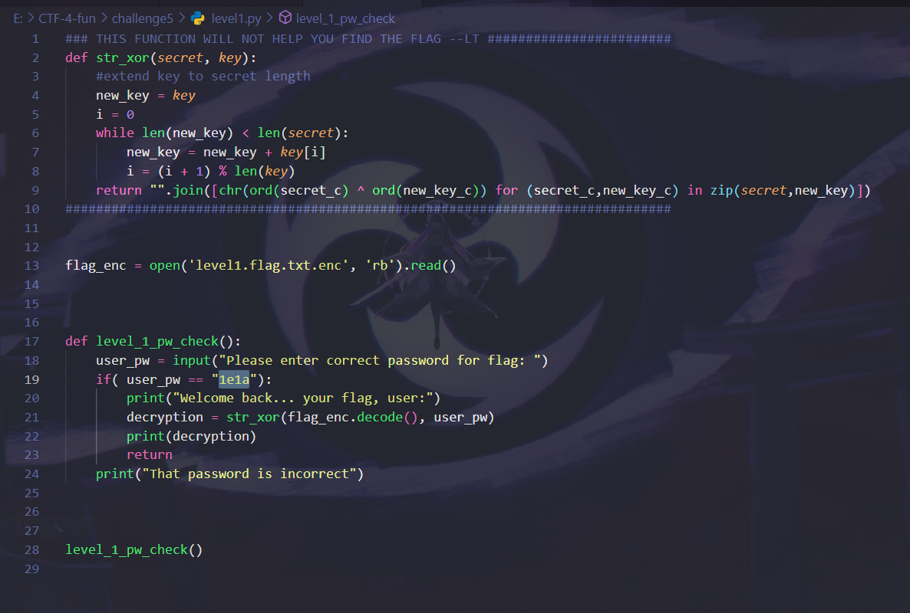

**Bước 3:** Và mật khẩu đã có sẵn, nên khi chạy file *level1.py*, tôi chỉ cần ghi đúng mật khẩu và chờ kết quả.

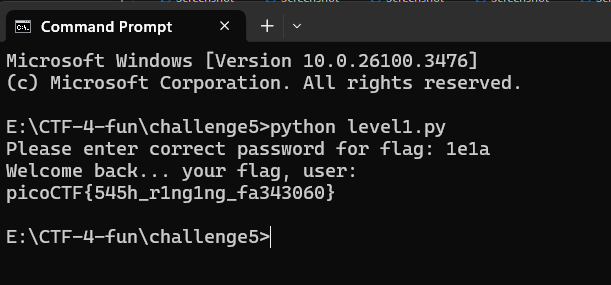

***Kết thúc!***

### PW Crack 2

Bài làm: [Tại đây](https://play.picoctf.org/practice/challenge/246?page=4)

**Bước 1:** Bài này cũng khá tương tự bài [PW Crack 1](#pw-crack-1), có điều mật khẩu không có lộ ra rõ như trước nữa.

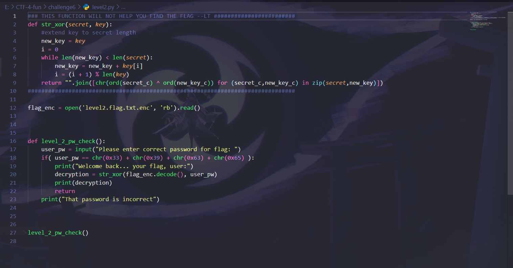

**Bước 2:** Vì các lệnh trong mật khẩu là *chr(0xXX)* nên tôi sẽ hiểu là việc của tôi chỉ là tra bảng mã ASCII sao cho số hexa (0xXX) tương ứng với ký tự nào trong bảng mã. (Hoặc đơn giản hơn là dùng công cụ hoặc chatGPT).

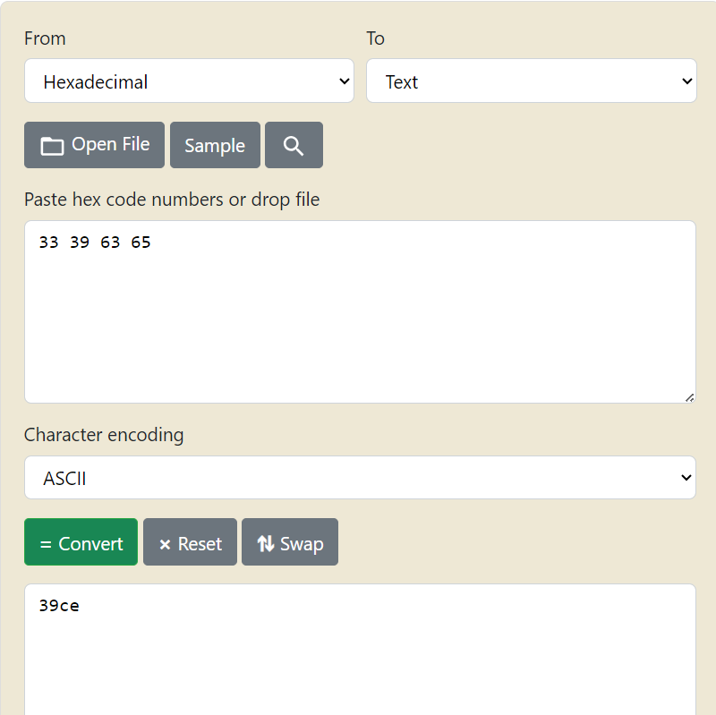

**Bước 3:** Tìm thấy mật khẩu nên chỉ việc chạy file và nhận kết quả.

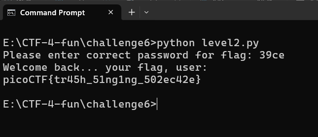

***Kết thúc!***

### converme.py

Bài làm: [Tại đây](https://play.picoctf.org/practice/challenge/239?page=4)


***Kết thúc!***

### fixme1.py

Bài làm: [Tại đây](https://play.picoctf.org/practice/challenge/240?page=4)

***Kết thúc!***

### fixme2.py

Bài làm: [Tại đây](https://play.picoctf.org/practice/challenge/241?page=4)

***Kết thúc!***

### Python Wrangling

Bài làm: [Tại đây](https://play.picoctf.org/practice/challenge/166?page=5)

***Kết thúc!***

### 2Warm

Bài làm: [Tại đây](https://play.picoctf.org/practice/challenge/86?page=6)

***Kết thúc!***

### Bases

Bài làm: [Tại đây](https://play.picoctf.org/practice/challenge/67?page=6)

***Kết thúc!***

### Warmed up

Bài làm: [Tại đây](https://play.picoctf.org/practice/challenge/58?page=6)

***Kết thúc!***

### Lets Warm Up

Bài làm: [Tại đây](https://play.picoctf.org/practice/challenge/22?page=7)

***Kết thúc!***

### FANtôiSY CTF

Bài làm: [Tại đây](https://play.picoctf.org/practice/challenge/471?page=1)

Bài này khá hay, giống 1 trò chơi và có phần lừa.

**Bước 1:** Theo yêu cầu đề bài cần chạy lệnh *"nc verbal-sleep.picoctf.net 57327"*, mà lệnh này thì chạy bằng *Ubuntu* nên tôi sẽ dùng *WSL* để chạy.

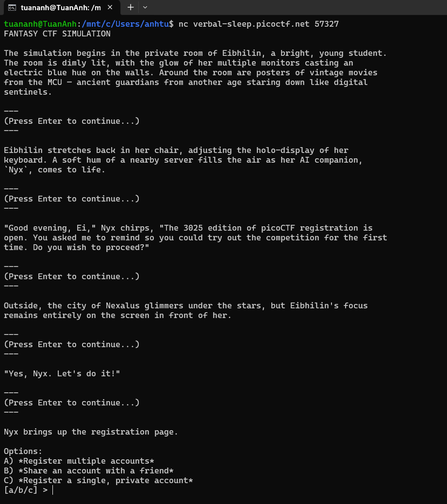

**Bước 2:** Sau khi kết nối thành công, tôi nhận được khá nhiều nội dung và yêu cầu tôi lựa chọn. Dựa theo nội dung sẵn bài này, tôi sẽ chọn đáp án **C**.

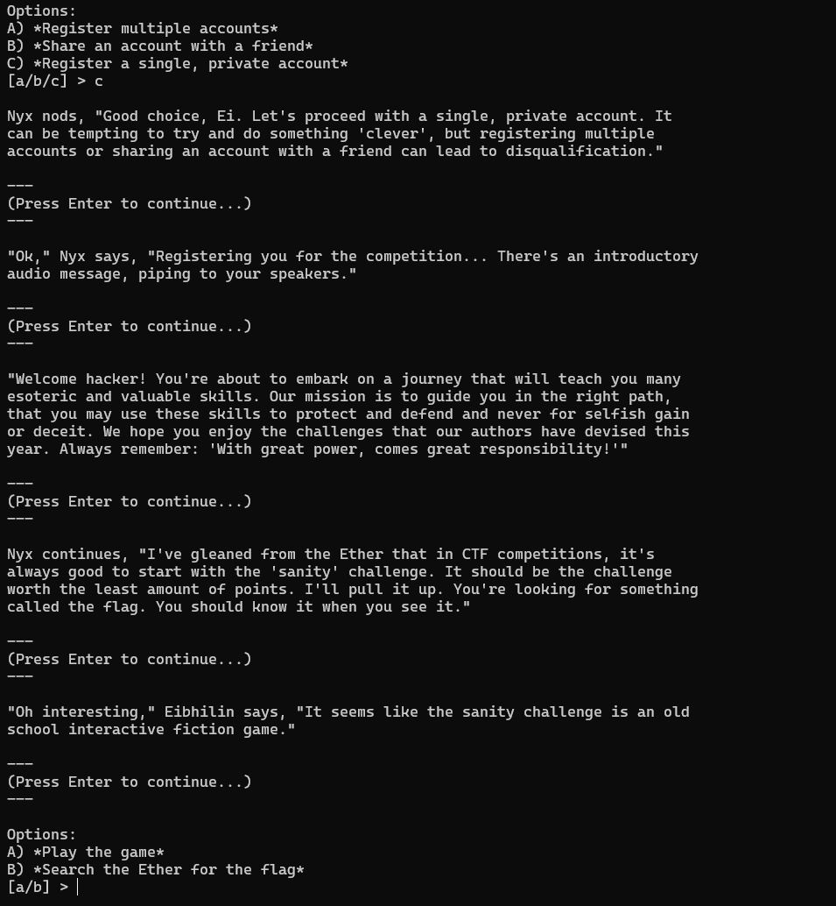

**Bước 3:** Sau khi đọc xong nội dung, căn bản không có nói lựa chọn nào tốt. Tôi sẽ thử chọn tìm Flag.

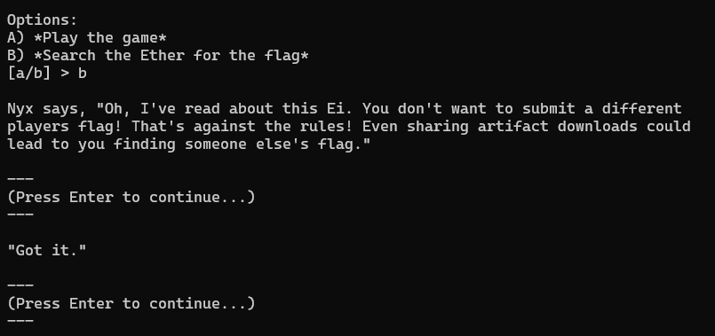

Bài sẽ có thông tin cảnh cáo, thử chạy lại lần nữa.

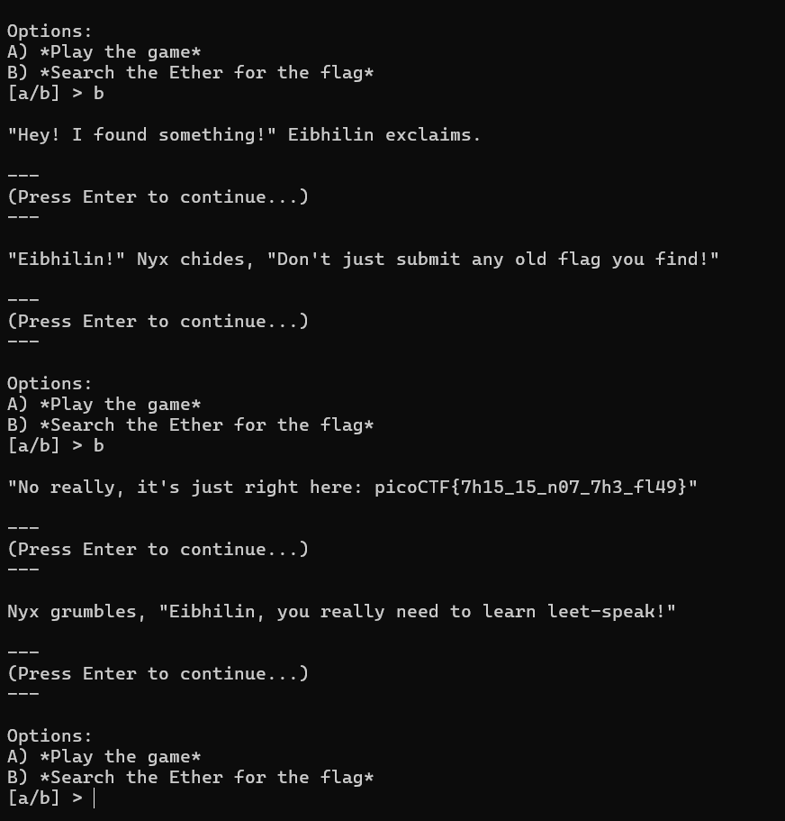

**Bước 4:** Dù đã có đoạn mã, nhưng dựa theo cảnh cáo là dịch theo leet-speak, cái đoạn mã này sẽ có nghĩa là **picoCTF\{this_is_not_the_flag\}**. Lúc này, tôi sẽ thử chơi trò chơi.

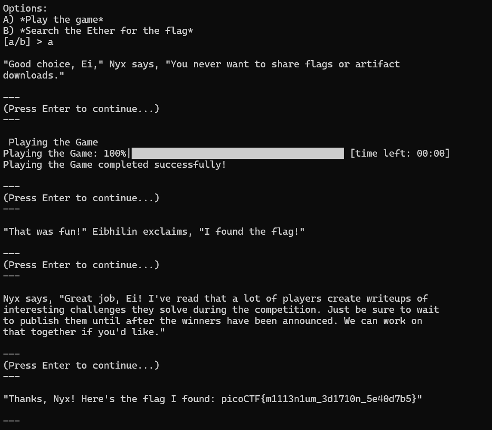

Lần này kết quả hoàn toàn chính xác.

Đoạn mã: **picoCTF\{m1113n1um_3d1710n_5e40d7b5\}**

***Kết thúc!***

## 2️⃣ Các bài mức trung bình

## 3️⃣ Các bài mức khó