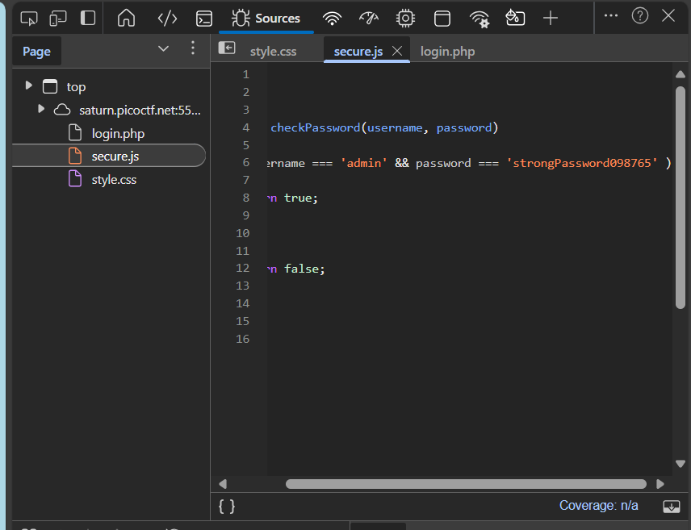
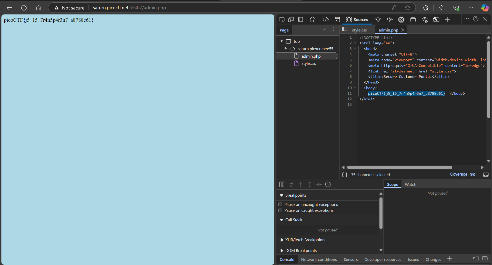

# CTF - WEB EXPLOTATION

> _"Trang này chủ yếu lấy những chủ đề CTF về Web Explotation. Từ ease -> medium -> hard."_

## 📌 Mục lục

- [1️⃣ Các bài mức dễ](#1️⃣-các-bài-mức-dễ)
    - [Local Authority](#local-authority)

- [2️⃣ Các bài mức trung bình](#2️⃣-các-bài-mức-trung-bình)

- [3️⃣ Các bài mức khó](#3️⃣-các-bài-mức-khó)

[CTF from picoCTF](https://play.picoctf.org/)

## 1️⃣ Các bài mức dễ 

### Local Authority

Bài làm: [Tại đây](https://play.picoctf.org/practice/challenge/278?page=4)

***Cách thực hiện:***

**Bước 1:** Kiểm tra source code thì không có gì bất thường. Tiến hành đăng nhập (tài khoản,mật khẩu bất kỳ).

**Bước 2:** Sau khi đăng nhập, thông tin sẽ trả về lỗi. Nhưng lúc này, ở source code đã có 1 file tên là secure.js, tiến hành kiểm tra file này và thấy thông tin đăng nhập hợp lệ.

**Bước 3:** Tiến hành đăng nhập bằng tài khoản đã thấy, ta sẽ thấy có mã CTF flag cần tìm.

***Kết thúc!***

## 2️⃣ Các bài mức trung bình

## 3️⃣ Các bài mức khó