# CTF - WEB EXPLOTATION

> _"Trang này chủ yếu lấy những chủ đề CTF về Web Explotation. Từ easy -> medium -> hard. Và tôi làm bài khá loạn xạ nên nếu mọi người muốn tìm bài gì thì cứ xem mục lục cho dễ nhé."_

## 📌 Mục lục

- [⚙️ Các công cụ được sử dụng để làm bài](#️-các-công-cụ-được-sử-dụng-để-làm-bài)
- [1️⃣ Các bài mức dễ](#1️⃣-các-bài-mức-dễ)
    - [Inspect HTML](#inspect-html)
    - [Local Authority](#local-authority)
    - [Includes](#includes)
    - [Bookmarklet](#bookmarklet)
    - [WebDecode](#webdecode)
- [2️⃣ Các bài mức trung bình](#2️⃣-các-bài-mức-trung-bình)

- [3️⃣ Các bài mức khó](#3️⃣-các-bài-mức-khó)

[CTF from picoCTF](https://play.picoctf.org/)

## ⚙️ Các công cụ được sử dụng để làm bài

## 1️⃣ Các bài mức dễ 

### Inspect HTML

Bài làm: [Tại đây](https://play.picoctf.org/practice/challenge/275?page=4)

*Note: Bài này tôi làm sau mà nó đơn giản quá nên để lên đầu🐧. Bài này chỉ full cách tra source luôn (để tôi nhớ)*

**Bước 1:** Nhìn vào trang nội dung, ta thấy không có bất kỳ thông tin nào cần để giải bài này.

**Bước 2:** Ấn chuột phải, chọn "Kiểm tra phần tử" hoặc "Inspect" (như trong hình).

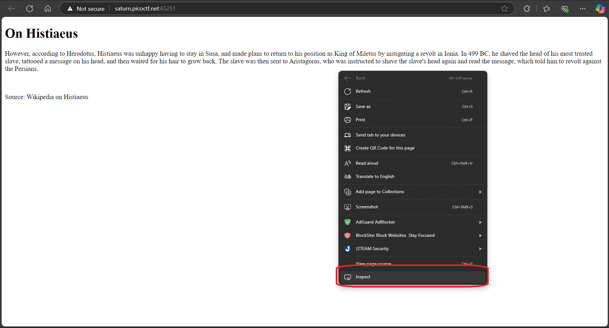

**Bước 3:** Lúc này, đã thấy mã cần tìm, nhưng vì lỡ chỉ rồi nên tôi chỉ cho trót các xem source 🐧. Thì bạn thấy ảnh con bọ không. Đúng rồi, ở cái ô màu đỏ đấy, ấn vào đi.

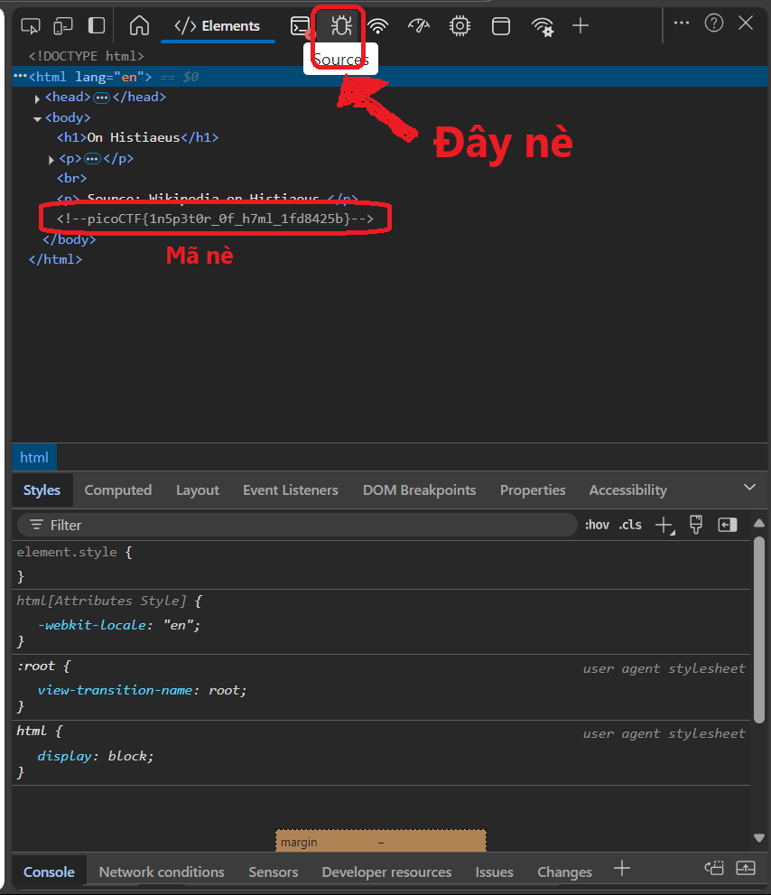

**Bước 4:** Cái nội dung lúc này là file html mà bạn thấy lúc mới vào. Và bài này khá đơn giản nên mã flag cần tìm cũng đã nằm ở phần comment

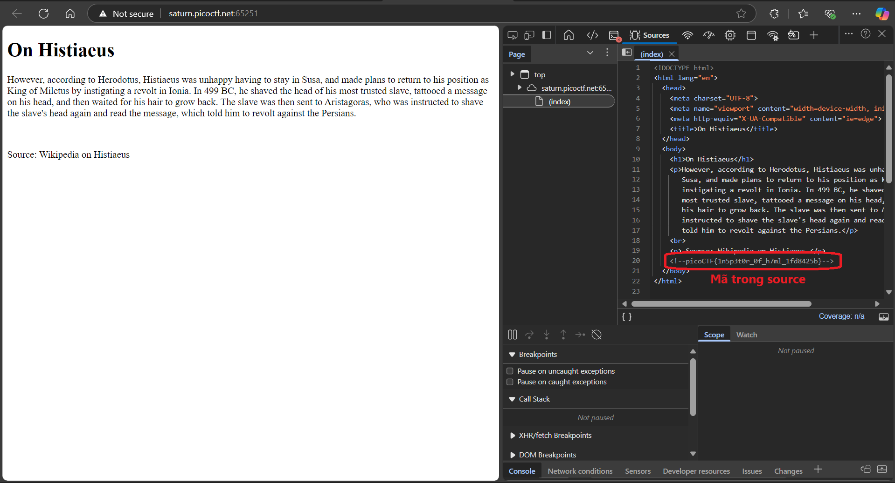

***Kết thúc!***

### Local Authority

Bài làm: [Tại đây](https://play.picoctf.org/practice/challenge/278?page=4)

***Cách thực hiện:***

**Bước 1:** Kiểm tra source code thì không có gì bất thường. Tiến hành đăng nhập (tài khoản,mật khẩu bất kỳ).

**Bước 2:** Sau khi đăng nhập, thông tin sẽ trả về lỗi. Nhưng lúc này, ở source code đã có 1 file tên là secure.js, tiến hành kiểm tra file này và thấy thông tin đăng nhập hợp lệ.

**Bước 3:** Tiến hành đăng nhập bằng tài khoản đã thấy, ta sẽ thấy có mã CTF flag cần tìm.

***Kết thúc!***

### Includes

Bài làm: [Tại đây](https://play.picoctf.org/practice/challenge/274?page=4)

***Cách thực hiện:***

**Bước 1:** Kiểm tra source và không thấy gì. Nhưng hiện tại ta thấy file html ban đầu, có dẫn đến 2 file khác gồm *style.css* và *script.js*. Và khi ta thử ấn nút button "say hello" thì liền có bảng thông báo hiện lên

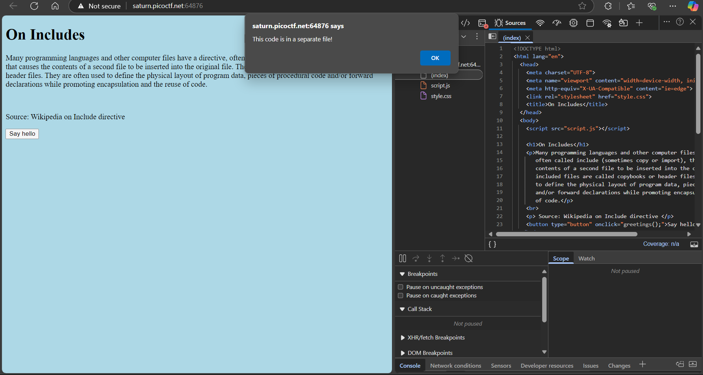

**Ta thấy ý chính của thông báo này là: Đoạn Flag đã bị chia ra ở các file khác nhau.**

**Bước 2:** Đã biết đoạn FLag bị chia thì ta chỉ việc kiểm tra 2 file. Và ghép từng đoạn ấy thành 1 đoạn Flag cần tìm.

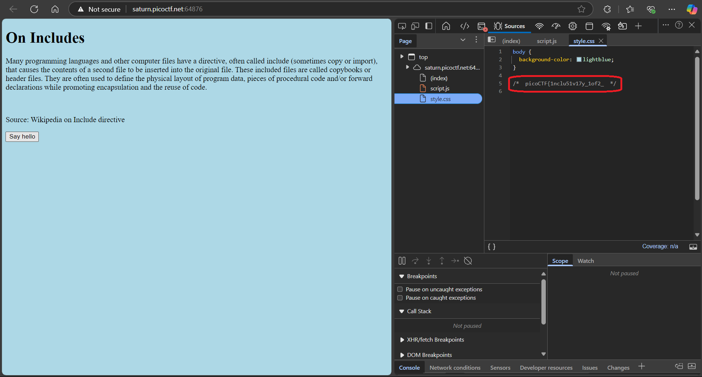

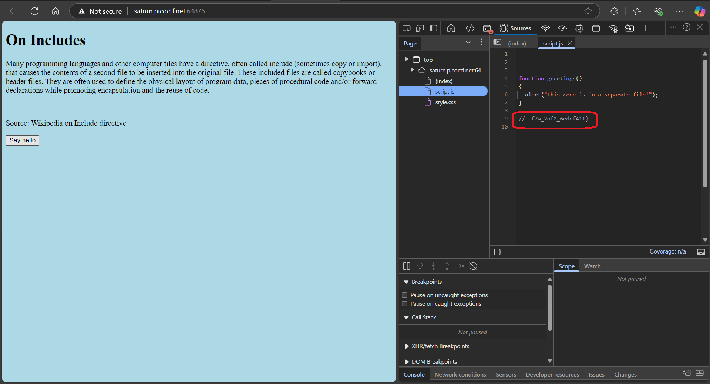

***Kết thúc!***

### Bookmarklet

Bài làm: [Tại đây](https://play.picoctf.org/practice/challenge/406?page=3)

**Bước 1:** Kiểm tra bài này thì thấy đoạn Flag đã bị mã hõa, và khi ta ấn vào khung terabox thì sẽ được copy code vào bộ nhớ tạm.

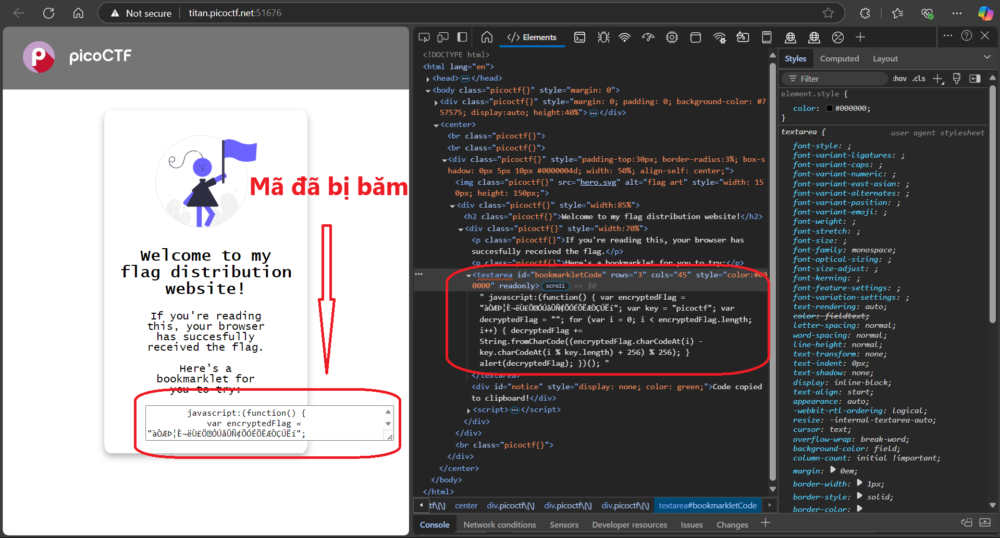

**Bước 2:** Có code rồi thì tất nhiên phải đi tìm cách chạy, vì ở đây có lệnh *alert* (lệnh để xuất thông báo nổi) nên ta có thể đưa vào **Console** và paste code vào đó.

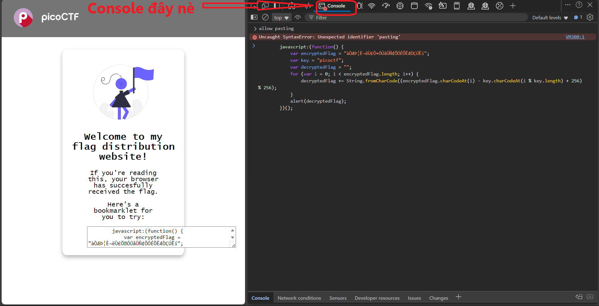

**Bước 3:** Thực ra chỉ cần ấn Enter và thiết bị sẽ alert ra đoạn Flag cần tìm.

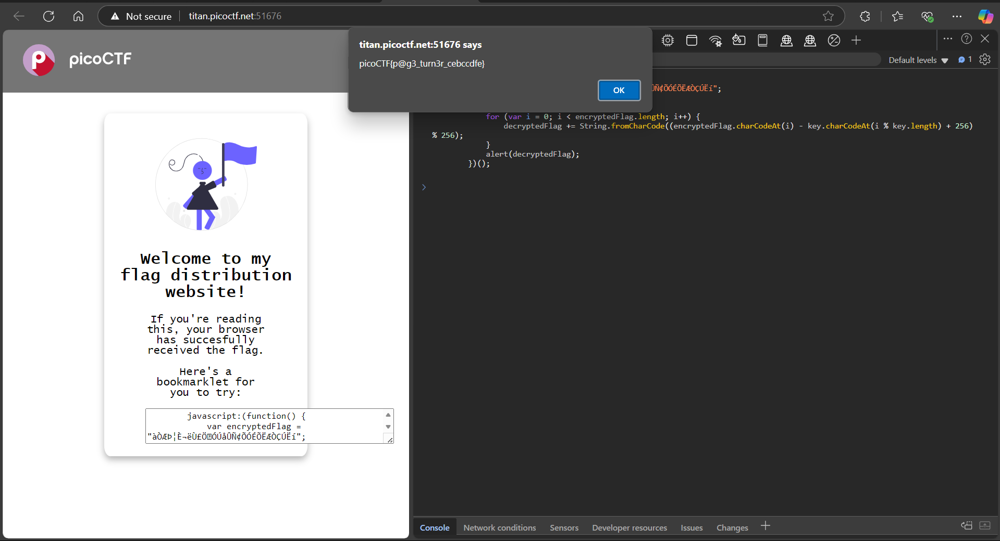

**Note: Tất nhiên đến lúc này thì không phải ai cũng thích làm cách rườm rà này. Điển hình như việc sẽ có vài người quẳng đoạn code vào chatGPT và kêu giải mã (như tôi). Thì sau đây là kết quả**

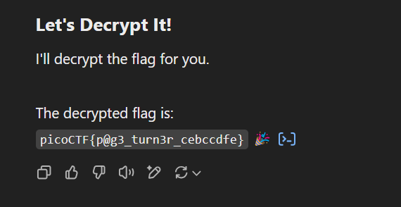

**Well, kết quả đúng nè.** 🎇

***Kết thúc!***

### WebDecode

Bài làm: [Tại đây](https://play.picoctf.org/practice/challenge/427?page=2)

**Bước 1:** Kiểm tra trang web thì thấy các file html, css không có bất kỳ nội dung bất thường nào cả.

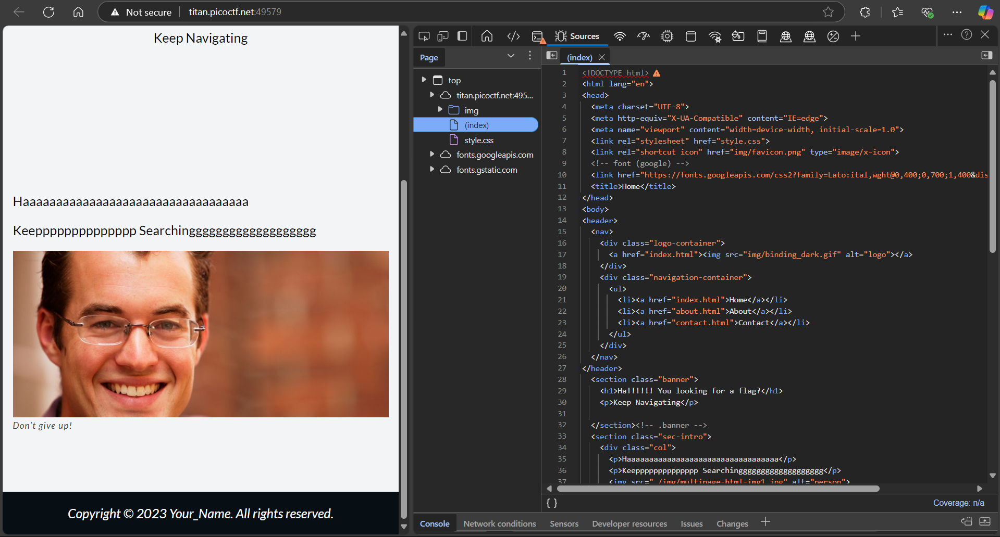

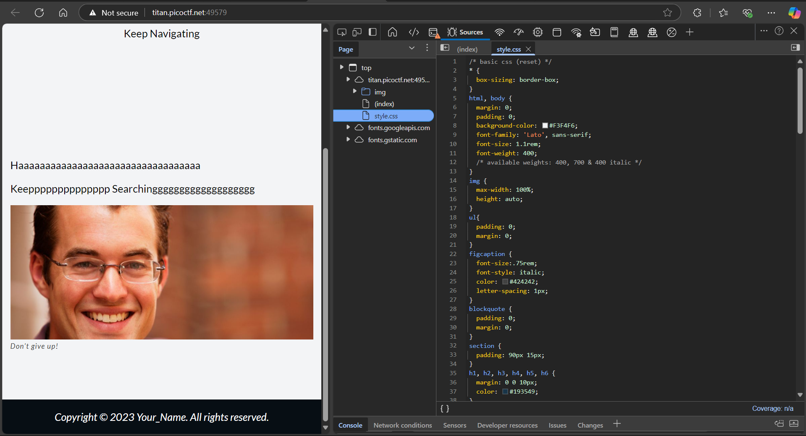

**Bước 2:** Thử kiểm tra các trang html khác, ta thấy ở trang *about.html* thì có một đoạn mã khá bất thường. Mà đoạn mã này lại theo định dạng Base64 nên có thể đoán rằng đây là đoạn Flag đã bị encode.

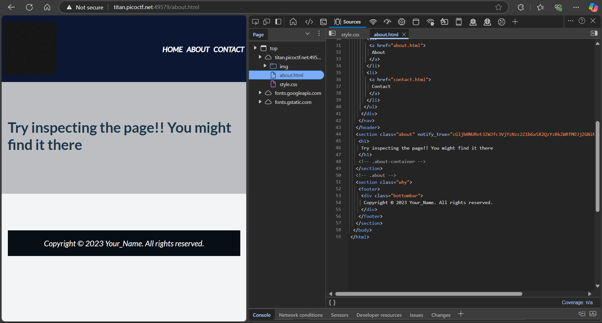

**Bước 3:** Thử sử dụng công cụ để giải mã (có thể là Base64 decode hoặc đơn giải hơn là chatGPT), ta thấy đoạn mã sau khi giải đúng là đoạn mã mà ta cần tìm.

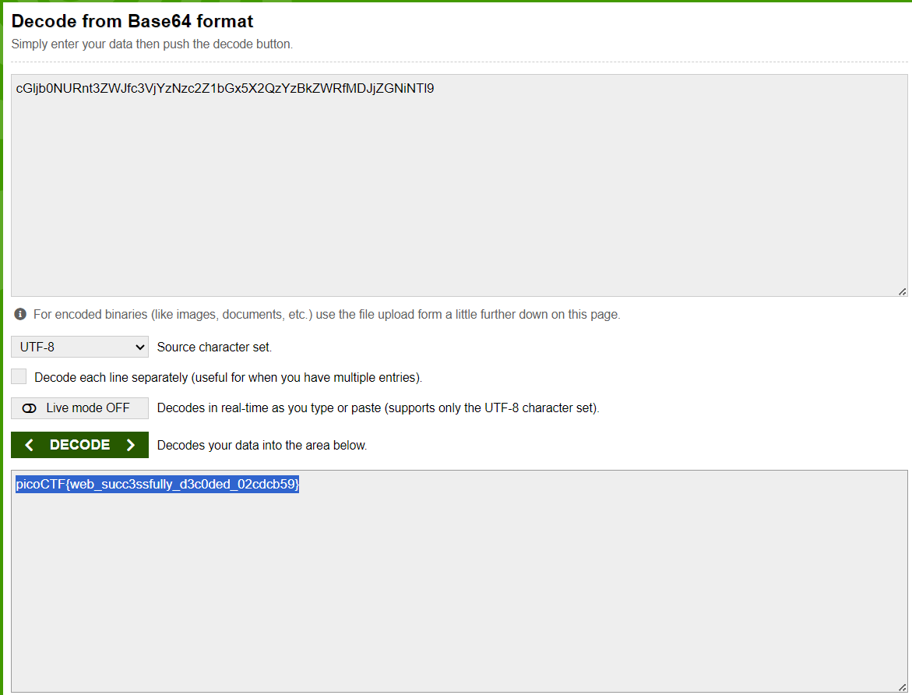

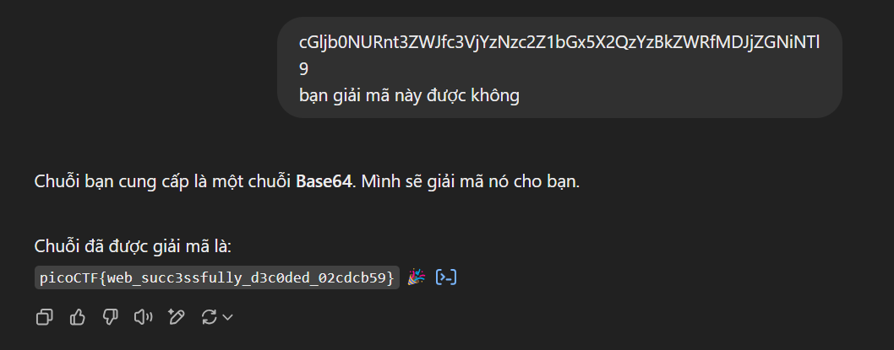

**Yeah, và thực sự đó là đáp án mà ta cần tìm!**

***Kết thúc!***

## 2️⃣ Các bài mức trung bình

## 3️⃣ Các bài mức khó